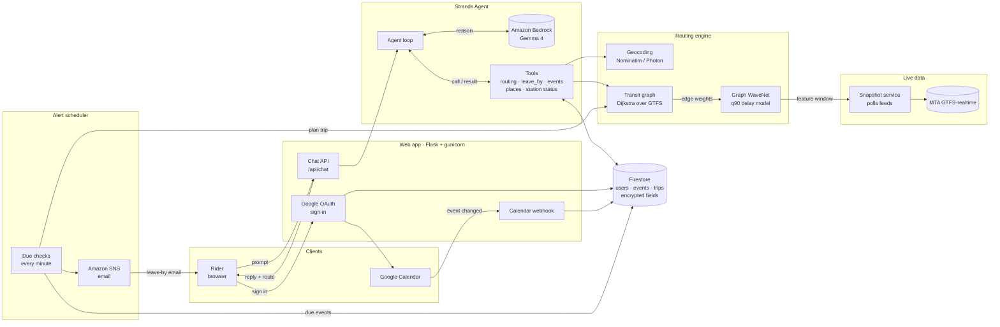

# Yoho Navigation

**An agent that tells New York City subway riders when to leave, and warns them before they're late.**

Built with the [Strands Agents SDK](https://strandsagents.com) and Amazon Bedrock for the
*Agents for Humans* hackathon (Everyday Agents track).

🔗 **Live demo:** `<LIVE_URL>` · 🎥 **Video:** `<VIDEO_URL>`

---

## The problem

NYC subway timing is unpredictable. Map apps give you the *scheduled* trip time, but
delays, bunched trains, and long platform waits mean that "22 minutes" is often 35.
Riders pad every trip by guesswork, or they're late to interviews, doctor's
appointments, and shifts, and nobody warns them in time.

**Who it's for:** anyone who rides the subway to things on their calendar: commuters,
students, shift workers, people who can't afford to miss an appointment.

**Why it matters:** a late arrival can cost a job, a paycheck, or a medical appointment.
Yoho uses live MTA data and a delay model to plan for a *realistic bad case* (90th
percentile), not the optimistic schedule, and it reaches out first when it's time to go.

## What it does

- **Chat with a transit agent.** Ask "When should I leave to get to 41 E 56th St by 7 PM?"
  and get a leave-by time, step-by-step directions, and the route drawn on a map.
- **Calendar-aware.** Sign in with Google and Yoho reads your calendar (read-only). It
  knows where you'll be: routes start from your current event's location, or from home.
- **"Leave now" email alerts.** When a calendar event with a location is coming up, the
  scheduler plans the trip with live data and emails a leave-by alert (Amazon SNS).
- **Live delay pricing.** A snapshot service polls MTA GTFS-realtime feeds, and a Graph
  WaveNet model predicts 90th-percentile ride and transfer times for every subway edge.
  Those predictions become the weights for pathfinding.
- **Rider controls.** Avoid lines or modes ("no buses", "avoid the L"), multi-stop trips,
  station status and service alerts along the route, schedule vs. live comparison.

## Architecture



### End-to-end flows

**1. Ask for a route (chat)**
1. The rider signs in with Google. Tokens and home address are encrypted and stored in Firestore.
2. The browser posts a message to `/api/chat`. The web app builds a Strands agent for that user.
3. The agent (Gemma 4 on Amazon Bedrock) picks tools: geocode the address, look up the
   current calendar event or home, then `leave_by` / `route_from_here` / `route_to_event`.
4. Routing runs Dijkstra over the MTA GTFS graph. Subway edges are weighted by the Graph
   WaveNet's 90th-percentile predictions from the snapshot service's live feature window.
5. The agent writes a reply. The web app returns it with the route geometry, and the map draws it.

**2. Get a "leave now" alert (calendar)**
1. Google Calendar pushes a change notification to the webhook. The event is synced to Firestore.
2. The alert scheduler (`scheduler/alerts_service.py`) checks every minute for events
   coming up within the lead time (default 60 min).
3. It plans the trip from the rider's previous location or home using live waits.
4. Amazon SNS emails a leave-by alert with directions and a link to the trip on the map.

**Security:** the model never sees or passes a user id. User-scoped tools are bound to the
signed-in user in code. Home addresses, event locations, and refresh tokens are encrypted
at rest (`storage/crypto.py`). Chat is capped by a weekly token budget per user.

More detail: [ARCHITECTURE.md](ARCHITECTURE.md), and the agent loop:


## Repository layout

| Path | What's there |
|---|---|
| `agent/` | Strands agent, tools, directions text, model setup (`agent_interaction.py`, `tools.py`) |
| `web/` | Flask app: Google auth, chat API, calendar webhook, pages, map JS |
| `accounts/` | Home, calendar sync, trips, alerts, token quota |
| `scheduler/` | Alert scheduler process, cron scheduler, calendar hook queue |
| `graph/` | Transit graph built from subway and bus GTFS, Dijkstra, service-period costs |
| `snapshot/` | Live MTA feed poller and HTTP service (feature window, platform waits) |
| `ml_model/` | Graph WaveNet, GAT, LightGBM edge-cost models, training and benchmarks |
| `mta_api/` | GTFS-realtime client, historical schedule and alert loaders |
| `geocoding/` | Nominatim and Photon address search |
| `integrations/` | Google Calendar/OAuth, Amazon SNS |
| `storage/` | In-memory, file, and Firestore stores; field encryption |
| `scripts/` | Data building, training data, end-to-end alert test |
| `tests/` | pytest suite |

## Running it

### Prerequisites
- Python 3.14 (what it's developed on)
- A Google Cloud project with the Calendar API enabled and an OAuth **Web application**
  client (redirect `http://localhost:5000/auth/google/callback`; scopes `openid`, `email`,
  `profile`, `calendar.readonly`)
- AWS account with Amazon Bedrock access (model `google.gemma-4-26b-a4b`) and, for alert
  emails, an SNS topic. Without Bedrock, the agent falls back to local Ollama `gemma4:e2b`.

### 1. Install
```bash
git clone https://github.com/shameedjob/yoho-navigation.git
cd yoho-navigation
python -m venv .venv && source .venv/bin/activate
pip install -r requirements.txt
# model training only: pip install -r requirements-training.txt
```

### 2. Data
`data/` (~1.5 GB) and `ml_model/checkpoints/` (~300 MB) are too large for git. Rebuild
them as follows, from the repo root.

**a. MTA static GTFS (required, a few minutes)**
```bash
mkdir -p data
for feed in gtfs_subway gtfs_supplemented gtfs_b gtfs_bx gtfs_m gtfs_q gtfs_si; do
  curl -L -o /tmp/$feed.zip https://rrgtfsfeeds.s3.amazonaws.com/$feed.zip
  unzip -o -q /tmp/$feed.zip -d data/$feed
done
```

**b. Transfer tables (required)**
```bash
python -m scripts.bus_transfers          # -> data/processed/bus_transfers.csv
python -m scripts.subway_bus_transfers   # -> data/processed/subway_bus_transfers.csv
```

**c. Training data and models (optional, hours)**

Skip this and the app still runs: routes are priced from the schedule plus live
first-train waits. These steps add the delay model.
```bash
pip install -r requirements-training.txt

mkdir -p data/training
# 30 sampled service days of historical subway trips (subwaydata.nyc + MTA schedule data)
python -m scripts.training_data --start 2026-01-01 --end 2026-05-31 --sample-days 30 \
  --out data/training/training_data_2026-sample30.csv

# Typical headways + wait models -> typical_headway.csv used by the snapshot service
python -m ml_model.train_waits --data data/training/training_data_2026-sample30.csv \
  --out ml_model/checkpoints/waits_2026-sample30

# Joint Graph WaveNet (rides + transfers), the model the agent loads (~110 s/epoch)
python -m ml_model.train_gat --architecture gwnet --with-transfers \
  --data data/training/training_data_2026-sample30.csv \
  --checkpoint ml_model/checkpoints/gwnet_joint_2026-sample30_buckets/gwnet.pt
```
The agent loads the checkpoint from `GRAPH_MODEL_PATH` (default above). Column contract:
[docs/MODEL_DATA.md](docs/MODEL_DATA.md); training/live feature parity:
[docs/FEATURE_PARITY.md](docs/FEATURE_PARITY.md).

### 3. Configure
```bash
cp .env.example .env
python -c "import secrets; print(secrets.token_urlsafe(32))"   # -> FLASK_SECRET_KEY
python -m storage.crypto                                        # -> YOHO_DATA_KEYS (back it up)
```
Fill in `GOOGLE_CLIENT_ID`, `GOOGLE_CLIENT_SECRET`, `YOHO_AGENT_MODEL`, `AWS_REGION`,
AWS credentials, and `YOHO_SNS_TOPIC_ARN`. Every setting is described in
[.env.example](.env.example) and [web/config.py](web/config.py).
Use `YOHO_STORE=file` locally; use `firestore` when the web app and scheduler run as separate processes.

### 4. Run (three processes)
```bash
# Live MTA snapshot service. Give it ~30 min to warm up for good predictions.
# Drop --typical-headways if you skipped step 2c.
python -m snapshot.service --port 8791 \
  --typical-headways ml_model/checkpoints/waits_2026-sample30/typical_headway.csv

# Web app -> http://localhost:5000
python -m web
# production: gunicorn -b 127.0.0.1:8000 --timeout 120 web.wsgi:app

# Alert scheduler (run exactly one)
python -m scheduler.alerts_service
```

### 5. Try the alert flow end to end
```bash
python -m scripts.e2e_alerts --email you@example.com
```
Runs calendar change → webhook → due check → route → email. Each outside service is real
when its keys are configured and faked otherwise. SNS requires confirming the subscription
email once.

### Tests
```bash
python -m pytest tests/
```

## For judges

- **Live app:** `<LIVE_URL>`
- **Sign-in:** use the demo Google account in the Devpost testing instructions. It has
  sample calendar events with locations.
- **Try:** set Home on the profile page, then ask
  *"When should I leave to get to Central Park by 7 PM?"*
- Use street addresses rather than landmark names for the most reliable geocoding.

## Built with

- **Strands Agents SDK**: agent loop and tool calling
- **Amazon Bedrock**: Gemma 4 model hosting
- **Amazon SNS**: alert email
- **Google Calendar API / OAuth**, **Firebase Firestore**
- **Flask**, **gunicorn**, **PyTorch** (Graph WaveNet), **LightGBM**, **pandas**

### Third-party data and prior work
- MTA GTFS static and GTFS-realtime feeds (subway and bus)
- [subwaydata.nyc](https://subwaydata.nyc) historical subway trip archives (model training)
- OpenStreetMap Nominatim and Photon geocoding; Esri basemap tiles
- Graph WaveNet architecture (Wu et al., 2019), reimplemented in `ml_model/graph_wavenet.py`
- AI coding assistance: Claude Code was used during development

## What's next
- Live bus arrivals from MTA Bus Time (buses are priced from schedules today)
- Deploy the agent on Amazon Bedrock AgentCore
- Amazon SES for branded alert email; SMS option
- Let riders pick between ambiguous address matches

## License

[MIT](LICENSE)
